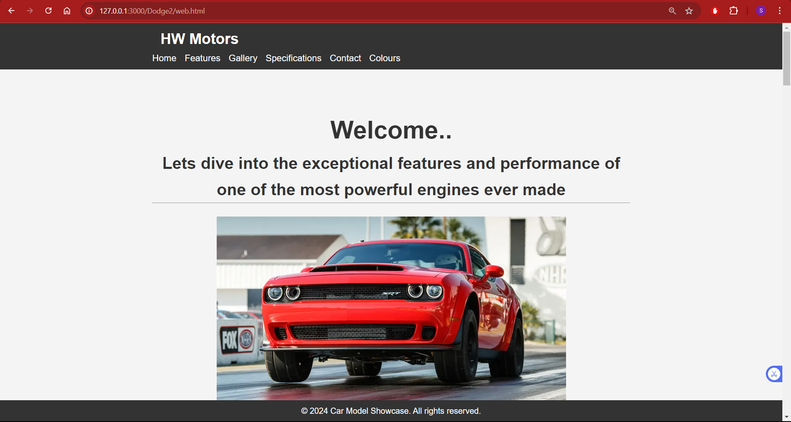
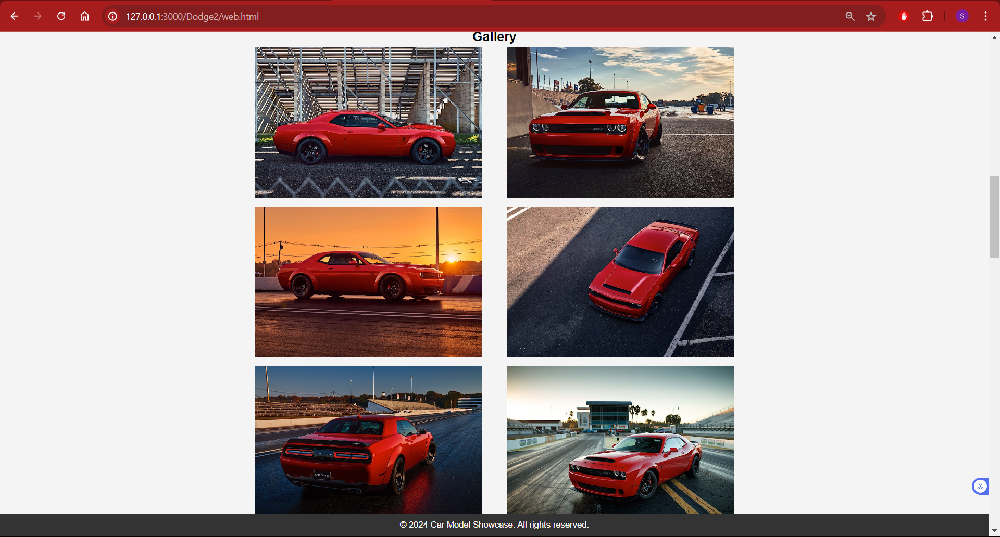
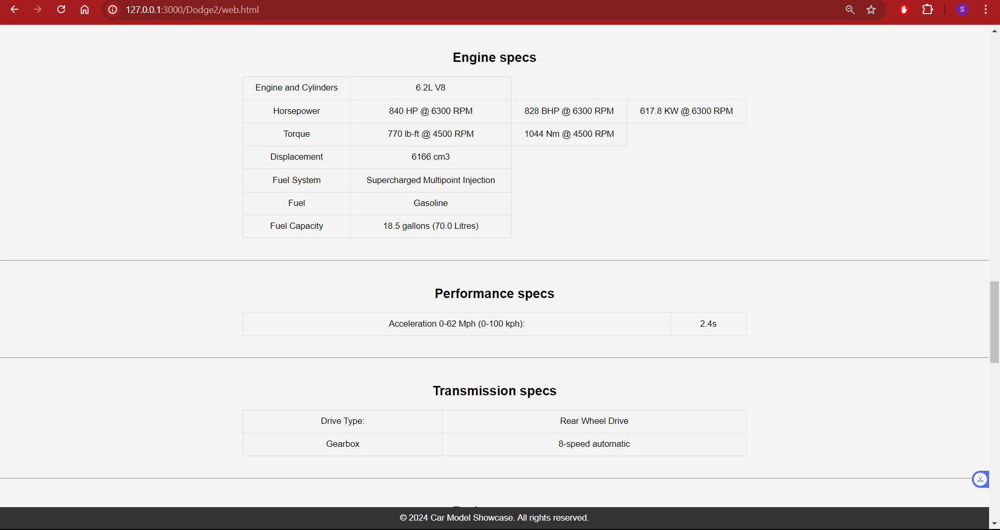

# Web2
Simple Website 2

Link: https://hwushyam2005.github.io/Web2/web.html
 
 
In this website i have involved working buttons and tables in several areas.
 
 
Also a navigation bar for redirecting within the webpage has been added with the following sections:
 
-> Home
 
-> Features
 
-> Gallery
 
-> Specifications
 
-> Contact
 
-> Colours
 
 
I have also added a few screen shots of how the website looks:
 
 
-> This screen shot of the webpage shows the home page including the working navigation bar with each sections.

 
 
-> This screen shot of the webpage shows the gallery section.

 
 
-> The engine specs and other related specs of the car has been shown.

 
 
One major thing I have added in this website is the contact us part with working buttons and detects if we have forgotten to fill out any text.
